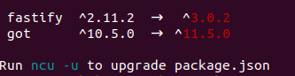
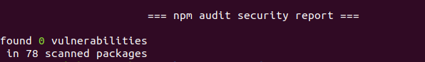

# node.js server security checklist

While there isn't any system 100% secure, following common security practices reduce the exposed superficie and avoid basic attacks and exploit.

---

- [ ] **Use strong secrets and store them safely**

  - use strong secrets: long and complex
  - use individual secrets and do not share them
  - store secrets encrypted and privately
  - remove dated, default and unnecessary accesses, especially from common applications like DBs
  - provide secrets to the application in env vars at runtime
  - do not commit files that contain secrets: [securing your repository](https://docs.github.com/en/github/administering-a-repository/securing-your-repository)

- [ ] **Use the latest version of the frameworks/libraries**

  Using the latest version of the software does not mean that it's more secure than the older one, but at least vulnerabilities are not yet discovered and old vulnerabilities _should_ be resolved.

  ```bash
  npm i -g npm-check-udpates
  ncu
  ```

  

- [ ] **Check for known vulnerabilities**

  [npm registry](https://www.npmjs.com/advisories) contains _known_ vulnerabilities of their packages, that can be checked by

  ```bash
  npm audit
  ```

  

- [ ] **Remove information that identify the tech**

  For example: `X-Powered-By` header and cookie `sessionid` name may reveal the technologies running on the server and that can address attacks for know vulnerabilities, especially if they are dated.

- [ ] **HTTPS**

  Use https over http to encrypt communication and avoid intermediate network points to sniff transferring data.

  See [MITM attack](https://owasp.org/www-community/attacks/Man-in-the-middle_attack)

- [ ] **Secure cookies**

  - do not store sensitive data in cookies
  - use `session` cookies
  - use `HttpOnly`, `SameSite` and `Secure` flags
  - restrict access to a single domain, without subdomains

- [ ] **Use an helmet**

  Use an "helmet" middleware to harden the web framework. It removes headers that identify the framework and add secure headers.  

  Follow headers should be set as base

  - `Strict-Transport-Security: max-age=31536000; includeSubDomains` prevent any communications from being sent over HTTP to the specified domain and will instead send all communications over HTTPS, for `max-age` (one year in the example)
  - `X-Frame-Options: SAMEORIGIN` prevent that the current page can be shown in an iframe from another domain
  - `X-DNS-Prefetch-Control: off` prevent links prefetching, so the browser will not load unintended urls by its own
  - `X-Content-Type-Options: nosniff` prevent the browser from interpreting different content from the one declared in `Content-Type`
  - `Content-Security-Policy: script-src 'self'` define content sources that are approved and thus allowing the browser to load them. It requires fine-tuning for web apps, see [full document](https://developer.mozilla.org/en-US/docs/Web/HTTP/CSP).
  - `X-XSS-Protection: 1; mode=block` enable XSS filter in modern browsers

  Useful libraries:

  - [helmet](https://github.com/helmetjs/helmet)
  - [fastify-helmet](https://github.com/fastify/fastify-helmet)

- [ ] **Prevent application crash**

  Manage different form of input from the expected ones; use `try-catch` blocks for faultable operations - most for the frameworks do that in route handlers

- [ ] **Control inputs**

  Input from "the outside" can be malicious, be **always** diffident with what the server could receive.

  > "In production, your software will not be used, will be abused!" [@KatyAnton](https://twitter.com/KatyAnton)

  Always validate inputs coming from request: `query`, `body`, url path (often in `params` using a framework).

  Do not forward straight input to other applications that the web server communicates, for example composing SQL statement and pass to DB cause sql injections.

  Use a validation library for inputs, like [ajv](https://github.com/ajv-validator/ajv), [joi](https://github.com/sideway/joi), [superstruct](https://github.com/ianstormtaylor/superstruct) or even better apply a validation schema.

  See [fastify validation](https://www.fastify.io/docs/latest/Validation-and-Serialization/#validation).

- [ ] **Control outputs**

  Encode output properly, escaping content that can inject malicious code.  

  While modern frontend frameworks usually prevent unintentional code injection (see [React dangerouslySetInnerHTML](https://reactjs.org/docs/dom-elements.html#dangerouslysetinnerhtml)), the server is still the source of content.  

  On SSR, content responsibility is a server duty.

  Useful libraries:

  - [he](https://github.com/mathiasbynens/he)
  - [jsesc](https://github.com/mathiasbynens/jsesc)

  See [Improper Output Handling](http://projects.webappsec.org/w/page/13246934/Improper%20Output%20Handling), [XSS attack](https://owasp.org/www-community/attacks/xss).

- [ ] **Control source**

  - setup CORS policy properly - most frameworks have a plugin
  - use a [synchronizer token](https://cheatsheetseries.owasp.org/cheatsheets/Cross-Site_Request_Forgery_Prevention_Cheat_Sheet.html#synchronizer-token-pattern) to checksum the request
  - implement a "blacklist"/"whitelist" to prevent known malicious requests, usually filtering by ip, that can be updated at runtime
  - use multi-factor authentication for sensible operations (always when involving money)

  See [CSRF attack](https://owasp.org/www-community/attacks/csrf).

- [ ] **Control request rate**

  Limit the amount of requests to a sustainable rate and slow down repetitive failing operations (for example login) to preserve resources for the designed purpose.

  Useful libraries:

  - [express-rate-limit](https://github.com/nfriedly/express-rate-limit)
  - [fastify-rate-limit](https://github.com/fastify/fastify-rate-limit)

  See

  - [DoS attack](https://owasp.org/www-community/attacks/Denial_of_Service)
  - [Brute Force attack](https://owasp.org/www-community/attacks/Brute_force_attack)

- [ ] **Control resources**

  Avoid the server crash because is out of resources (like disk space and memory) and also tracking regular activities. Monitoring is very different because of the environment (cloud, container, vps, and so on) and method (trace collector, polling queries) but **always** be sure to take under control resources usage and availability. Abnormal traffic is evidence of an attack.

- [ ] **Test**

  A +95% coverage is a good index of server reliability: while even full covered code can have bugs, tested code _should_ avoid the most evident ones.

## References

- "Node Cookbook", chap. 8 "Dealing with security"
- http://projects.webappsec.org/f/WASC-TC-v2_0.pdf
- https://owasp.org/www-project-secure-headers/#div-headers
- https://cheatsheetseries.owasp.org/index.html
